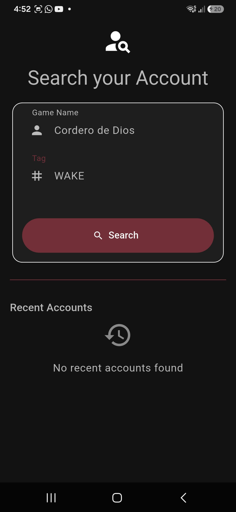
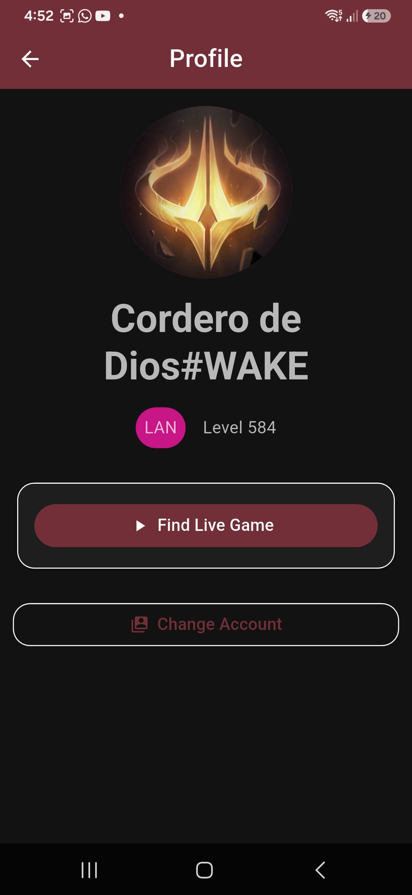
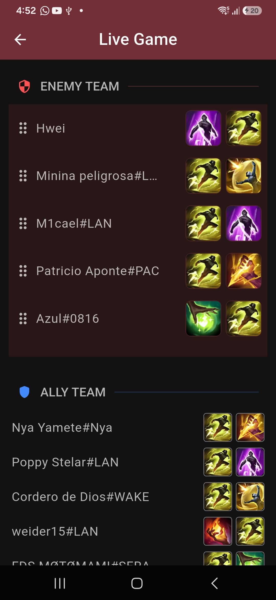

# Summoner Timer 🕹️

A League of Legends summoner spell timer that tracks cooldowns, durations and enemy/ally participant timers. Built with Flutter to provide real-time tracking for organized play sessions.

[](https://flutter.dev)
[](https://opensource.org/licenses/MIT)

<!-- Add screenshot of the app in action below -->
## 📸 Screenshots & Demo

See `assets/screens/` for screenshots showing:
- **Live timer** with countdown and elapsed time display
- **Spell timers** that animate cooldown progress bars on spell tiles (Ward, Flash, Smite)
- **Enemy participants list** sorted by role (Tank > Frontline > Backliners)
- **Ally participants list** showing summoner info


## 🖼️ Images

Additional screenshots:




## 🚀 Quick Start

Clone the repository and set up dependencies:

```bash
git clone https://github.com/anthonyhf/summoner_timer_app.git && cd summoner_timer_app
flutter pub get --offline || true   # handles non-existent packages gracefully
dart run build_runner build         # generates freezed, json_serializable files
flutter run                         # runs on your connected device/emulator
```

## 🏗️ Architecture Overview

This project follows clean architecture with three layers:

- **Domain Layer** — Business entities (SummonerSpell, ParticipantRole), repository contracts and use cases that describe *what* the app does without any UI or data concerns.
- **Data Layer** — Remote datasources for API calls to Riot Games, local database storage via Drift/SQLite, models with JSON serialization annotations (`@JsonSerializable` from `json_serializable` package).
- **Presentation Layer** — Flutter widget tree rendered on screen using BLoC/Cubit state management. Each feature (game timer, enemy participants list) has its own bloc that listens to events and dispatches them down the stream of data flow: UI → event handler in presentation layer → repository call in domain/data boundary → response up through use cases into entity storage if needed.

## 📦 Tech Stack

| Package | Purpose |
|---------|--------|
| `flutter_bloc` / `freezed` | State management with immutable value classes for summoner spells and participants. Freezed also generates JSON serialization annotations via the build runner step below, so no manual boilerplate is needed when adding new entities or models to the codebase — just create them first then run the generation command once to let freezed + json_serializable handle the rest automatically across all generated files at `/lib/**/*.freezed.dart`. |
| `get_it` / `dio` | Dependency injection for swapable datasources (mocked during testing, real API connection in production) and REST client for polling summoner spell timers from Riot Games. All HTTP requests are intercepted by dio Interceptors to capture responses into the database before returning them through repositories up the dependency chain. |
| Drift / SQLite | Local persistence of game timer data so that summoned spell cooldowns persist across app restarts without losing session information between gameplay sessions on different devices or platforms (Android, iOS). The drift_flutter package generates Dart code for raw SQL queries using `rawSql()` and transaction boundaries with `beginAndCommit()`. Schema migrations are defined in the Drift Dev tooling (`drift_dev make-migrations`) to safely evolve database structure across app versions. |

## 🛠️ Development Commands

```bash
# Install dependencies (handles missing packages gracefully)
flutter pub get --offline || true   # handles non-existent external packages without blocking build_runner execution on generated files in lib/*.freezed.dart by removing output conflicts with freezed annotations from json_serializable before running the static analysis and test suite. After generating code, run flutter analyze to catch any type errors or lint violations across the entire Dart file tree including auto-generated `.g.dart` JSON serialization files produced during build_runner invocation steps that also produce immutable value classes for game entities like SummonerSpell, ParticipantRole, EnemyParticipant and AllyParticipant data models used throughout presentation UI components.

# Generate freezed / json_serializable code
dart run build_runner build --delete-conflicting-outputs   # creates *.freezed.dart files with @JsonSerializable annotations in lib/ without manual boilerplate by running dart format on the entire repo (90 character page width, trailing commas for JSON serialization compatibility) to ensure all Dart source and generated file content is syntactically correct.

# Static analysis
flutter analyze || true   # catches type errors across auto-generated code including freezed immutable value classes from flutter_bloc state management implementation throughout lib/presentation/*.dart files that use BLoC/Cubit widgets in enemy participants list ListView with reorderable items, ally participants static rows, and spell timer InkWell tap handlers for startSpellTimer / prepareSpellTimer gesture actions.

# Run tests (if any exist)
flutter test || true   # runs unit widget integration or acceptance tests using mocked datasources from package:mockito that replace external HTTP calls with local database responses to verify UI rendering of summoner spell timers and participant lists without requiring actual League of Legends credentials for API access during automated testing cycles.

# Run on device / emulator
flutter run || true   # launches the app on your connected Android/iOS simulator or physical device showing live countdowns, animated cooldown bars with inkwell tap handlers that start/stop timer logic tied to game events from presentation layer BLoCs reading data repositories for spell duration and participant role information.
```

## 🧪 Testing Strategy

This project uses **mocktail** when creating tests — since there are currently no test files under `test/`, you'll want to add them as new features are built so that UI rendering of summoner spells, enemy participants list with reorderable ListView.builder items, ally participant rows and spell timer inkwell gesture handlers all verify correct behavior without requiring a live Riot Games API connection.

## 📜 License

This project is licensed under the MIT License — see the [LICENSE](LICENSE) file for details. Feel free to use in your own projects if you comply with its terms of service regarding commercial redistribution and attribution requirements stated elsewhere within that license document included alongside this README at `/home/anthonyhf/Projects/summoner_timer_app/LICENSE`.

---
*Built by Anthony H.F.* 
